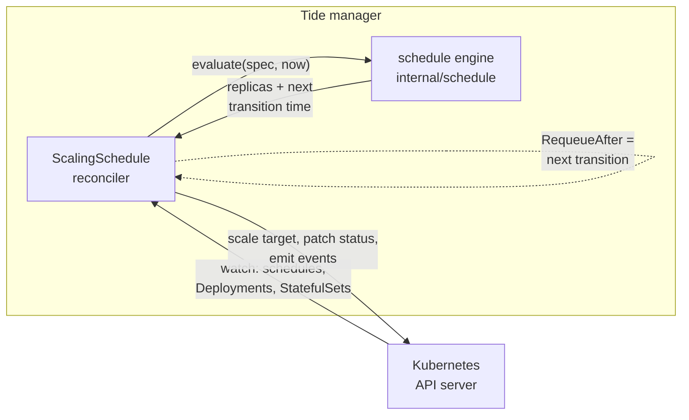

# Tide

[](https://github.com/alexli8408/tide/actions/workflows/ci.yaml)

**Time-based autoscaling for Kubernetes.** Tide is an operator that scales
Deployments and StatefulSets on recurring weekly schedules — 5 replicas during
business hours, 1 overnight — declared as a `ScalingSchedule` custom resource:

```yaml
apiVersion: tide.alexli8408.github.io/v1alpha1
kind: ScalingSchedule
metadata:
  name: web-hours
spec:
  targetRef:
    kind: Deployment
    name: web
  timeZone: America/Toronto
  defaultReplicas: 1
  windows:
    - name: business-hours
      days: [Mon, Tue, Wed, Thu, Fri]
      start: "08:30"
      end: "18:00"
      replicas: 5
```

## Why

Horizontal Pod Autoscalers react to load *after* it arrives. For workloads
with predictable traffic (internal tools, staging environments, batch
consumers), scheduled scaling is simpler and cheaper: capacity exists before
the morning rush, and the cluster isn't paying for idle replicas overnight.

## How it works



- **Event-driven, no polling.** Each reconcile computes the instant the
  decision next changes and requeues itself for exactly that boundary
  (`RequeueAfter`). Between boundaries the controller is idle.
- **Self-healing.** Tide indexes schedules by `targetRef` and watches the
  workloads themselves. A manual `kubectl scale` on a managed workload maps
  back to its schedule through the index and is reverted immediately.
- **Timezone- and DST-correct.** Windows are wall-clock times in an IANA
  timezone. Occurrences are built with civil-date arithmetic (never "+24h"),
  so a 09:00 start stays 09:00 across daylight-saving transitions; a boundary
  falling inside a spring-forward gap resolves forward to the transition
  instant, so windows touching the skipped hour shrink by the gap instead of
  silently inverting. The tzdata database is compiled into the binary for
  distroless images.
- **Safe overlap semantics.** When windows overlap, the highest replica count
  wins — no window can accidentally scale below what another demands.
- **Honest status.** Conditions (`Ready` with typed reasons), the active
  window, desired replicas, and the next transition are published on the
  status subresource and surfaced as `kubectl get` printer columns.

## Spec reference

| Field | Description |
| --- | --- |
| `targetRef` | Deployment or StatefulSet to scale, same namespace only |
| `timeZone` | IANA name (default `UTC`); DST handled by tzdata |
| `defaultReplicas` | Replica count when no window is active |
| `windows[].days` | `Mon`…`Sun`; a wrapping window belongs to its start day |
| `windows[].start`/`end` | 24h `"HH:MM"`; `end <= start` wraps past midnight |
| `windows[].replicas` | Replica count while the window is active |
| `suspend` | Stop scaling but keep evaluating and reporting status |

Invalid specs (bad timezone, malformed times) are rejected by CRD validation
where possible; the rest surface as `Ready=False / InvalidSchedule` without
retry storms — the controller waits for the spec to be edited.

## Quickstart

```sh
# Requires a cluster (kind works fine) and kubectl
kind create cluster

# Install the CRD and deploy the controller
make deploy

# Apply the demo workload + schedule and watch it
kubectl apply -f config/samples/demo.yaml
kubectl get scalingschedules -w
```

```
NAME        TARGET   DESIRED   WINDOW           NEXT                   READY   AGE
web-hours   web      5         business-hours   2026-08-28T22:00:00Z   True    12s
```

To run the controller locally against the current kubeconfig context instead:

```sh
make install   # CRD only
make run
```

## Development

```sh
make test       # fmt, vet, unit + controller tests
make generate   # regenerate deepcopy, CRD, RBAC after changing api/
make build      # build bin/manager
make help       # everything else
```

The test suite runs entirely in-process: the schedule engine is a pure
function tested against fixed instants (midnight wraps, DST spring-forward
and fall-back, timezone conversions), and the reconciler is tested with
controller-runtime's fake client and an injected frozen clock — no cluster,
no envtest binaries, CI-friendly.

## Project layout

```
api/v1alpha1/        CRD types + generated deepcopy
internal/schedule/   pure schedule evaluation (no k8s imports)
internal/controller/ reconciler, watches, field index
cmd/                 manager entrypoint
config/              CRD, RBAC, manager manifests, samples
```

## Design decisions

- **No finalizer.** Tide owns no external resources; deleting a schedule
  simply stops managing the target. Cleanup logic that has nothing to clean
  up is a liability, not a feature.
- **Same-namespace targets only.** The API shape itself rules out
  cross-namespace privilege escalation.
- **One schedule per target.** If several schedules claim the same workload,
  they would revert each other's scaling forever. The oldest schedule (ties
  broken by name) wins deterministically; the rest report
  `Ready=False / ConflictingTarget` and never touch the target.
- **Start/end windows instead of cron.** One window is one declarative
  statement; a cron up/down pair can drift apart and has no natural answer
  for "what should replicas be *right now*" after a controller restart.
- **`suspend` keeps evaluating.** A suspended schedule still reports what it
  would do, so re-enabling it is never a surprise.

## Roadmap

- [ ] Grace periods: ramp down N minutes after a window ends
- [ ] `scale` subresource support to target any scalable CRD
- [ ] Validating webhook for cross-field checks at admission time
- [ ] Prometheus metrics for scale operations and schedule drift
- [ ] Helm chart

## License

MIT
